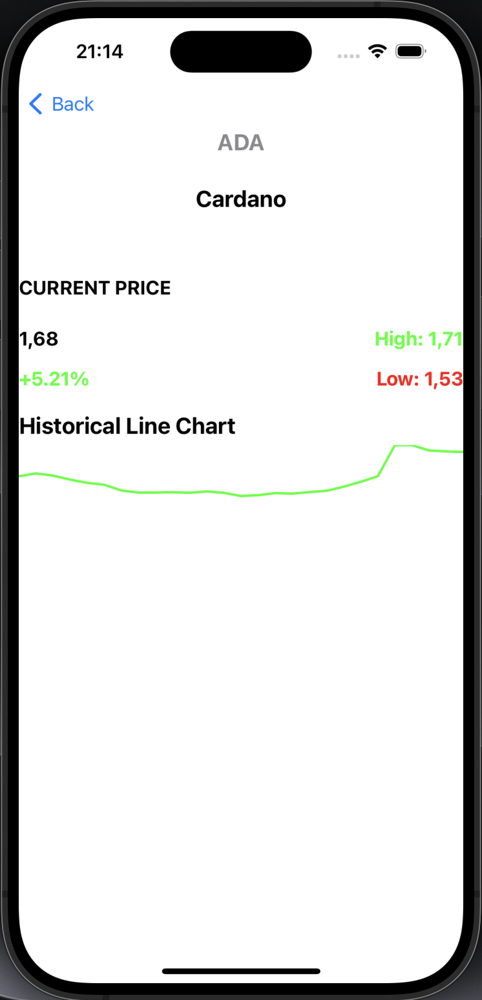

# FinanceDB

FinanceDB is a simple iOS application designed to display cryptocurrency information fetched from a remote API. It provides users with a list of cryptocurrencies along with their details such as price, market cap, volume, and change.

## Design and Architectural Patterns

The app follows the Model-View-ViewModel (MVVM) architectural pattern. This pattern was chosen for its ability to separate concerns and improve testability and maintainability. Each component of the app, including the view controllers, view models, and services, is responsible for a specific set of tasks, resulting in a clean and organized codebase.

## Technologies Used

- Swift Programming Language
- UIKit Framework
- Alamofire for networking
- Kingfisher for image loading
- JSONDecoder for parsing JSON data

## Screenshots

| Main App Screen | Change Filtered App Screen | Coin Detail Screen |
|:---------------:|:--------:|:--------:|
|  |  |  |

## Areas for Improvement

- **UI/UX Enhancements**: The app's user interface could be further improved to enhance the overall user experience. This includes adding animations, refining layout designs, and optimizing performance.
  
- **Error Handling**: Although error handling is implemented, it could be enhanced to provide better user feedback and recovery options in case of network errors or API failures.
  
- **Unit Testing**: While the architecture facilitates unit testing, more comprehensive test coverage could be added to ensure the reliability and stability of the app.

## App Submission Readiness

The app is not yet ready for submission to the App Store. To achieve submission readiness, the following steps need to be taken:

- **App Icon and Launch Screen**: Design and implement an app icon and launch screen to enhance the app's branding and visual appeal.
  
- **Privacy Policy**: Include a privacy policy to comply with App Store guidelines regarding user data collection and privacy.
  
- **Localization**: Localize the app's text and resources to support multiple languages and regions.

## Assumptions and Comments

- **Third-Party Libraries**: The project uses third-party libraries such as Alamofire and Kingfisher to simplify networking and image loading tasks, respectively. These libraries were chosen for their reliability, popularity, and ease of use.

## Missing Features and Open Issues

- **Advanced Sorting and Filtering**: The app currently supports basic sorting and filtering options. Implementing more advanced sorting and filtering functionalities could enhance the user experience.
  
- **Offline Support**: Implementing offline support to cache data and provide basic functionality even when the device is offline would improve usability in low-connectivity scenarios.

## Requirements

- **Xcode**: The project requires Xcode to build and run.
  
- **Internet Connection**: An active internet connection is required to fetch cryptocurrency data from the remote API.

## Credits

GameDB was created by Cemalhan Alptekin.
